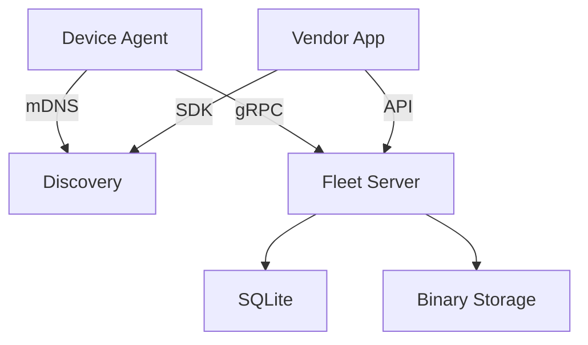

# fleetd

> [!WARNING]
> This is _very_ early work in progress.

Manage your fleet of edge devices; provision, update, monitor, and secure.

The fleet daemon, _fleetd_, is a long-running service that monitors and manages the lifecycle of devices and deployed software in the fleet.

The fleet services are RPC services that are used by the fleet daemon to manage the fleet. These can be run centrally or distributed.

## Architecture

