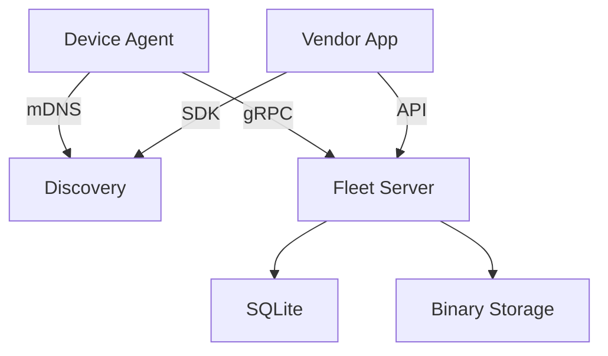

# fleetd

> [!WARNING]
> This is _very_ early work in progress.

Manage your fleet of edge devices; provision, update, monitor, and secure.

The fleet daemon, _fleetd_, is a long-running service that monitors and manages the lifecycle of devices and deployed software in the fleet.

The fleet services are RPC services that are used by the fleet daemon to manage the fleet. These can be run centrally or distributed.

## Architecture



## Device Provisioning

The `fleetp` tool is used to provision devices with the fleetd agent and optional components.

### Prerequisites

- SD card reader connected to your computer
- Raspberry Pi SD card (8GB minimum recommended)
- WiFi credentials (if not using Ethernet)

### List Available Devices

```bash
# List all connected block devices suitable for provisioning
fleetp -list
```

### Basic Provisioning (Raspberry Pi OS)

Provision a Raspberry Pi with the standard Raspberry Pi OS and fleetd agent:

```bash
# Basic provisioning with WiFi
fleetp -device /dev/disk2 -wifi-ssid "MyNetwork" -wifi-pass "password"

# With SSH access enabled
fleetp -device /dev/disk2 -wifi-ssid "MyNetwork" -wifi-pass "password" \
  -ssh-key ~/.ssh/id_rsa.pub

# With custom device name
fleetp -device /dev/disk2 -wifi-ssid "MyNetwork" -wifi-pass "password" \
  -name "rpi-workshop-01"

# With specific fleet server
fleetp -device /dev/disk2 -wifi-ssid "MyNetwork" -wifi-pass "password" \
  -fleet-server https://fleet.example.com:8080
```

### DietPi Provisioning

For a minimal, optimized installation using DietPi:

```bash
# DietPi with fleetd agent
fleetp -device /dev/disk2 -wifi-ssid "MyNetwork" -wifi-pass "password" \
  -device-type dietpi

# DietPi with SSH and custom configuration
fleetp -device /dev/disk2 -wifi-ssid "MyNetwork" -wifi-pass "password" \
  -device-type dietpi -ssh-key ~/.ssh/id_rsa.pub \
  -name "dietpi-node-01"
```

### Provisioning with k3s

Deploy Raspberry Pi devices as k3s nodes:

```bash
# k3s server node
fleetp -device /dev/disk2 -wifi-ssid "MyNetwork" -wifi-pass "password" \
  -plugin k3s -plugin-opt k3s.role=server

# k3s agent node (worker)
fleetp -device /dev/disk2 -wifi-ssid "MyNetwork" -wifi-pass "password" \
  -plugin k3s -plugin-opt k3s.role=agent \
  -plugin-opt k3s.server=https://192.168.1.100:6443 \
  -plugin-opt k3s.token=K10abc...xyz::server:abc...

# k3s with custom configuration
fleetp -device /dev/disk2 -wifi-ssid "MyNetwork" -wifi-pass "password" \
  -plugin k3s -plugin-opt k3s.role=server \
  -plugin-opt k3s.cluster-init=true \
  -plugin-opt k3s.disable=traefik
```

### Multiple Plugins

You can combine multiple plugins during provisioning:

```bash
# k3s with Docker
fleetp -device /dev/disk2 -wifi-ssid "MyNetwork" -wifi-pass "password" \
  -plugin k3s -plugin-opt k3s.role=agent \
  -plugin-opt k3s.server=https://192.168.1.100:6443 \
  -plugin docker

# Full stack with monitoring
fleetp -device /dev/disk2 -wifi-ssid "MyNetwork" -wifi-pass "password" \
  -plugin k3s -plugin-opt k3s.role=server \
  -plugin docker \
  -plugin prometheus \
  -plugin grafana
```

### Provisioning Options

| Flag | Description | Example |
|------|-------------|---------|
| `-device` | Target device path | `/dev/disk2`, `/dev/sdb` |
| `-device-type` | Device type (auto-detected if omitted) | `rpi`, `dietpi`, `esp32` |
| `-name` | Device hostname | `rpi-node-01` |
| `-wifi-ssid` | WiFi network name | `MyNetwork` |
| `-wifi-pass` | WiFi password | `password123` |
| `-ssh-key` | SSH public key file | `~/.ssh/id_rsa.pub` |
| `-fleet-server` | Fleet server URL | `https://fleet.local:8080` |
| `-plugin` | Enable plugin | `k3s`, `docker` |
| `-plugin-opt` | Plugin configuration | `k3s.role=server` |
| `-verbose` | Verbose output | - |
| `-dry-run` | Preview without writing | - |

### After Provisioning

1. **Insert the SD card** into your Raspberry Pi and power it on
2. **Wait for boot** (typically 2-3 minutes for first boot)
3. **Device discovery**: The device will automatically:
   - Connect to WiFi (if configured)
   - Start the fleetd agent
   - Register with the fleet server via mDNS discovery
   - Begin reporting telemetry

4. **Access the device** (if SSH was enabled):
   ```bash
   ssh pi@<device-ip>
   # or if you set a custom name
   ssh pi@rpi-workshop-01.local
   ```

5. **Verify k3s** (if installed):
   ```bash
   ssh pi@<device-ip>
   sudo k3s kubectl get nodes
   ```

### Troubleshooting

- **Device not listed**: Ensure the SD card is properly connected and unmounted
- **Permission denied**: Run with `sudo` on Linux/macOS
- **WiFi not connecting**: Verify SSID and password, check 2.4GHz compatibility
- **k3s issues**: Check logs with `sudo journalctl -u k3s`
- **mDNS discovery**: Ensure devices are on the same network segment