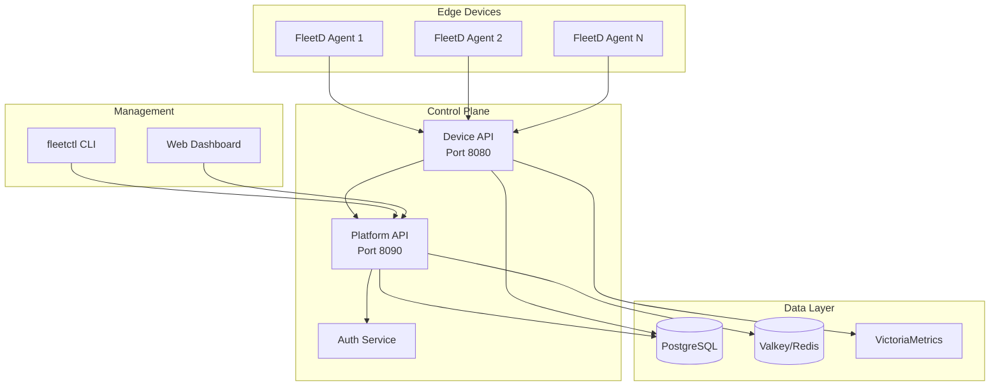

# FleetD - Edge Device Fleet Management Platform

[](https://go.dev/)
[](LICENSE)
[]()

FleetD is a production-ready edge device fleet management platform that provides centralized control, monitoring, and deployment capabilities for distributed IoT and edge computing infrastructure.

## 🚀 Features

### Core Capabilities
- **Device Management**: Register, monitor, and control edge devices at scale
- **Fleet Operations**: Organize devices into logical fleets with tags and metadata
- **Secure Communication**: JWT-based authentication with refresh tokens and API keys
- **Real-time Monitoring**: Metrics collection and aggregation with Prometheus/VictoriaMetrics
- **Deployment Pipeline**: Automated software deployment and rollback capabilities
- **High Availability**: Built-in circuit breakers, rate limiting, and graceful degradation

### Security Features
- **Authentication & Authorization**: RBAC with multiple user roles (Admin, Operator, Viewer)
- **TLS/mTLS Support**: Encrypted communication between services
- **API Key Management**: Programmatic access with scoped API keys
- **Audit Logging**: Complete audit trail for compliance
- **Rate Limiting**: Per-IP and per-user rate limiting with token bucket algorithm

### Observability
- **Distributed Tracing**: OpenTelemetry integration with request ID propagation
- **Structured Logging**: JSON logs with trace IDs for correlation
- **Metrics Collection**: Prometheus-compatible metrics endpoint
- **Health Checks**: Liveness and readiness probes for Kubernetes

## 🏗️ Architecture



## 📦 Installation

### Prerequisites
- Go 1.21 or higher
- PostgreSQL 14+ or SQLite (for development)
- Docker & Docker Compose (optional)
- Make or Just (task runner)

### Quick Start

1. **Clone the repository**
```bash
git clone https://github.com/yourusername/fleetd.git
cd fleetd
```

2. **Install dependencies**
```bash
go mod download
```

3. **Run with Docker Compose (recommended)**
```bash
docker-compose up -d
```

4. **Or run locally**
```bash
# Start PostgreSQL and Valkey
docker-compose up -d postgres valkey

# Run migrations
just migrate-up

# Start Platform API
just platform-api-dev

# In another terminal, start Device API
just device-api-dev

# In another terminal, start an agent
just agent-dev
```

## 🔧 Configuration

### Environment Variables

| Variable | Description | Default |
|----------|-------------|---------|
| `FLEETD_DB_HOST` | Database host | `localhost` |
| `FLEETD_DB_PORT` | Database port | `5432` |
| `FLEETD_DB_NAME` | Database name | `fleetd` |
| `FLEETD_DB_USER` | Database user | `fleetd` |
| `FLEETD_DB_PASSWORD` | Database password | `fleetd_secret` |
| `FLEETD_JWT_SECRET` | JWT signing key | Required |
| `FLEETD_VALKEY_ADDR` | Valkey/Redis address | `localhost:6379` |
| `FLEETD_AUTH_MODE` | Auth mode (production/development) | `production` |
| `FLEETD_LOG_LEVEL` | Log level (debug/info/warn/error) | `info` |

### Configuration File

Create a `config.toml` file:

```toml
[platform_api]
host = "0.0.0.0"
port = 8090

[device_api]
host = "0.0.0.0"
port = 8080

[database]
host = "localhost"
port = 5432
name = "fleetd"
user = "fleetd"
sslmode = "disable"

[valkey]
addr = "localhost:6379"

[security]
jwt_ttl = "1h"
refresh_ttl = "7d"
```

## 🛠️ Development

### Building from Source

```bash
# Build all binaries
make build

# Or build individually
go build -o bin/platform-api ./cmd/platform-api
go build -o bin/device-api ./cmd/device-api
go build -o bin/fleetctl ./cmd/fleetctl
go build -o bin/fleetd ./cmd/agent
```

### Running Tests

```bash
# Unit tests
go test ./...

# Integration tests
INTEGRATION=1 go test ./test/integration/...

# With coverage
go test -cover -coverprofile=coverage.out ./...
go tool cover -html=coverage.out
```

### Database Migrations

```bash
# Apply migrations
just migrate-up

# Rollback last migration
just migrate-down

# Create new migration
just migrate-create add_new_table
```

## 🎮 Using fleetctl

The `fleetctl` CLI provides comprehensive fleet management capabilities:

### Authentication

```bash
# Login to platform
fleetctl login
Email: admin@fleetd.local
Password: ********

# Check authentication status
fleetctl config get-context
```

### Device Management

```bash
# List all devices
fleetctl devices list

# Get device details
fleetctl devices get device-001

# Update device metadata
fleetctl devices update device-001 --tags env=prod,region=us-east

# View device logs
fleetctl devices logs device-001 --follow

# Get device metrics
fleetctl devices metrics device-001
```

### Fleet Operations

```bash
# Create a fleet
fleetctl fleet create production --description "Production devices"

# Add devices to fleet
fleetctl fleet add-device production device-001 device-002

# Deploy software
fleetctl deploy create --fleet production --version v1.2.3
```

## 🔒 Security

### Default Credentials

For development/demo purposes, the platform creates a default admin user:
- Email: `admin@fleetd.local`
- Password: `admin123`

**⚠️ Change these credentials immediately in production!**

### API Authentication

All API endpoints require authentication except health checks. Include the JWT token in requests:

```bash
curl -H "Authorization: Bearer YOUR_TOKEN" http://localhost:8090/api/v1/devices
```

### API Key Usage

For programmatic access:

```bash
# Create API key
fleetctl api-key create --name "CI/CD Pipeline" --scopes read,deploy

# Use API key
curl -H "X-API-Key: fleetd_xxxxx" http://localhost:8090/api/v1/devices
```

## 📊 Monitoring

### Metrics Endpoint

Prometheus-compatible metrics are available at:
- Platform API: `http://localhost:8090/metrics`
- Device API: `http://localhost:8080/metrics`

### Grafana Dashboards

Access Grafana at `http://localhost:3001` (admin/admin) for:
- Device fleet overview
- API performance metrics
- System resource usage
- Error rate monitoring

### Health Checks

- `/health` - Basic health check
- `/health/live` - Kubernetes liveness probe
- `/health/ready` - Kubernetes readiness probe

## 🚢 Deployment

### Docker

```bash
# Build images
docker build -f Dockerfile.platform-api -t fleetd/platform-api .
docker build -f Dockerfile.device-api -t fleetd/device-api .

# Run with docker-compose
docker-compose up -d
```

### Kubernetes

```bash
# Apply manifests
kubectl apply -f k8s/namespace.yaml
kubectl apply -f k8s/configmap.yaml
kubectl apply -f k8s/secrets.yaml
kubectl apply -f k8s/deployments/
kubectl apply -f k8s/services/
```

### Helm

```bash
# Install with Helm
helm install fleetd ./charts/fleetd \
  --namespace fleetd \
  --create-namespace \
  --set jwt.secret=your-secret-key \
  --set postgresql.auth.password=secure-password
```

## 📈 Performance

### Benchmarks

| Operation | Requests/sec | P95 Latency |
|-----------|-------------|-------------|
| Device Registration | 5,000 | 25ms |
| Status Update | 10,000 | 15ms |
| Fleet Query | 8,000 | 20ms |
| Auth Login | 2,000 | 50ms |

### Scaling Guidelines

- **Small (< 1,000 devices)**: Single instance of each service
- **Medium (1,000 - 10,000 devices)**: 3 replicas with load balancing
- **Large (> 10,000 devices)**: Horizontal pod autoscaling with dedicated database cluster

## 🤝 Contributing

Please read [CONTRIBUTING.md](CONTRIBUTING.md) for details on our code of conduct and the process for submitting pull requests.

### Development Workflow

1. Fork the repository
2. Create your feature branch (`git checkout -b feature/amazing-feature`)
3. Commit your changes (`git commit -m 'Add amazing feature'`)
4. Push to the branch (`git push origin feature/amazing-feature`)
5. Open a Pull Request

## 📝 License

This project is licensed under the Apache License 2.0 - see the [LICENSE](LICENSE) file for details.

## 🙏 Acknowledgments

- Built with [Connect-RPC](https://connectrpc.com/) for efficient API communication
- Uses [VictoriaMetrics](https://victoriametrics.com/) for time-series data
- Powered by [Valkey](https://valkey.io/) for caching and rate limiting
- UI components from [shadcn/ui](https://ui.shadcn.com/)

## 📞 Support

- 📧 Email: support@fleetd.sh
- 💬 Discord: [Join our community](https://discord.gg/fleetd)
- 📖 Documentation: [docs.fleetd.sh](https://docs.fleetd.sh)
- 🐛 Issues: [GitHub Issues](https://github.com/yourusername/fleetd/issues)

---

**FleetD** - Enterprise-grade edge device fleet management, simplified.