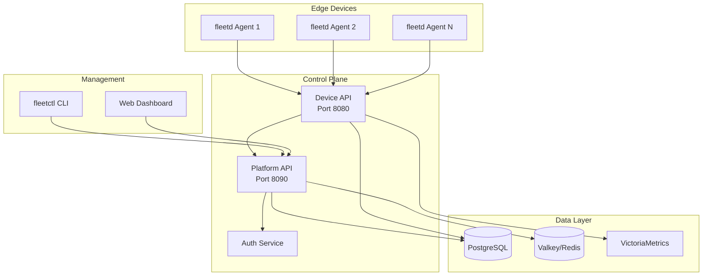

# fleetd - Modern IoT Device Management Platform

[](https://go.dev/)
[](LICENSE)
[](https://github.com/fleetd-sh/fleetd/actions)
[](https://goreportcard.com/report/github.com/fleetd-sh/fleetd)
[](https://discord.gg/fleetd)

The fleetd platform is a production-ready IoT device fleet management system that provides centralized control, monitoring, and deployment capabilities for distributed edge computing infrastructure.

## Quick Start

### One-Line Installation

```bash
# Install fleetd CLI
curl -sSL https://github.com/fleetd-sh/fleetd/releases/latest/download/install.sh | sh

# Start local platform (requires Docker)
fleetctl start

# Open the dashboard
open http://localhost:3000
```

### 30-Second Demo

```bash
# 1. Clone and setup
git clone https://github.com/fleetd-sh/fleetd.git && cd fleetd
just install

# 2. Start everything
just dev

# 3. Register a simulated device
fleetctl device simulate --count 10

# 4. View in dashboard
open http://localhost:3000
```

## Features

### Core Capabilities
- **Device Management**: Register, monitor, and control edge devices at scale
- **Device Fleet Operations**: Organize devices into logical device fleets with tags and metadata
- **Secure Communication**: JWT-based authentication with refresh tokens and API keys
- **Real-time Monitoring**: Metrics collection and aggregation with Prometheus/VictoriaMetrics
- **Deployment Pipeline**: Automated software deployment and rollback capabilities
- **High Availability**: Built-in circuit breakers, rate limiting, and graceful degradation

### Security Features
- **Authentication & Authorization**: RBAC with multiple user roles (Admin, Operator, Viewer)
- **TLS/mTLS Support**: Encrypted communication between services
- **API Key Management**: Programmatic access with scoped API keys
- **Audit Logging**: Complete audit trail for compliance
- **Rate Limiting**: Per-IP and per-user rate limiting with token bucket algorithm

### Observability
- **Distributed Tracing**: OpenTelemetry integration with request ID propagation
- **Structured Logging**: JSON logs with trace IDs for correlation
- **Metrics Collection**: Prometheus-compatible metrics endpoint
- **Health Checks**: Liveness and readiness probes for Kubernetes

## Architecture



## Installation

### Prerequisites
- Go 1.21+ (for development)
- Docker & Docker Compose
- [Just](https://just.systems/) task runner
- [Bun](https://bun.sh/) (for web UI development)

### Production Installation

```bash
# Install fleetd CLI
curl -sSL https://github.com/fleetd-sh/fleetd/releases/latest/download/install.sh | sh

# Deploy with Docker Compose
cd ~/.fleetd
docker-compose -f docker-compose.production.yml up -d

# Or deploy to Kubernetes
kubectl apply -f https://raw.githubusercontent.com/fleetd-sh/fleetd/main/deployments/kubernetes/
```

### Development Setup

```bash
# Clone repository
git clone https://github.com/fleetd-sh/fleetd.git
cd fleetd

# Install dependencies
just install

# Start development environment
just dev  # Starts all services with hot reload

# Or start services individually
just platform-api-dev  # Platform API on :8090
just device-api-dev    # Device API on :8080
just web-dev          # Studio UI on :3000
```

### Using fleetctl

```bash
# Start local platform
fleetctl start

# Check status
fleetctl status

# View logs
fleetctl logs -f

# Stop platform
fleetctl stop
```

## Configuration

### Environment Variables

| Variable | Description | Default |
|----------|-------------|---------|
| `FLEETD_DB_HOST` | Database host | `localhost` |
| `FLEETD_DB_PORT` | Database port | `5432` |
| `FLEETD_DB_NAME` | Database name | `fleetd` |
| `FLEETD_DB_USER` | Database user | `fleetd` |
| `FLEETD_DB_PASSWORD` | Database password | `fleetd_secret` |
| `FLEETD_JWT_SECRET` | JWT signing key | Required |
| `FLEETD_VALKEY_ADDR` | Valkey/Redis address | `localhost:6379` |
| `FLEETD_AUTH_MODE` | Auth mode (production/development) | `production` |
| `FLEETD_LOG_LEVEL` | Log level (debug/info/warn/error) | `info` |

### Configuration File

Create a `config.toml` file:

```toml
[platform_api]
host = "0.0.0.0"
port = 8090

[device_api]
host = "0.0.0.0"
port = 8080

[database]
host = "localhost"
port = 5432
name = "fleetd"
user = "fleetd"
sslmode = "disable"

[valkey]
addr = "localhost:6379"

[security]
jwt_ttl = "1h"
refresh_ttl = "7d"
```

## Development

### Building from Source

```bash
# Build all binaries
just build-all

# Build specific components
just build platform-api
just build device-api
just build fleetctl

# Build Docker images
just docker-build-all
```

### Running Tests

```bash
# Run unit tests only
just test

# Run integration tests (requires database)
INTEGRATION=1 just test-integration

# Run e2e tests
just test-e2e

# Run all tests (unit + integration + e2e)
INTEGRATION=1 just test-all
```

**Note on Integration Tests**: Following best practices, integration tests use environment variables instead of build tags. Tests will skip with a helpful message if the required environment variable is not set. This approach makes tests more discoverable and prevents hidden build errors.

To run integration tests manually:
```bash
# Set the environment variable
export INTEGRATION=1

# Run specific integration test
go test ./test/integration/... -v

# Or run a single test
go test ./test/integration/... -run TestAuthDeviceFlow_RequestDeviceCode -v
```

### Database Operations

```bash
# Run migrations
just db-migrate

# Rollback migration
just db-rollback

# Create new migration
just db-migration add_device_tags

# Reset database
just db-reset
```

### Code Quality

```bash
# Format all code
just format-all

# Lint all code
just lint-all

# Run pre-commit checks
just pre-commit
```

## Using fleetctl

The `fleetctl` CLI provides comprehensive fleet management capabilities:

### Authentication

```bash
# Login to platform
fleetctl login
Email: admin@fleetd.local
Password: ********

# Check authentication status
fleetctl config get-context
```

### Device Management

```bash
# List all devices
fleetctl devices list

# Get device details
fleetctl devices get device-001

# Update device metadata
fleetctl devices update device-001 --tags env=prod,region=us-east

# View device logs
fleetctl devices logs device-001 --follow

# Get device metrics
fleetctl devices metrics device-001
```

### Device Fleet Operations

```bash
# Create a device fleet
fleetctl fleet create production --description "Production devices"

# Add devices to device fleet
fleetctl fleet add-device production device-001 device-002

# Deploy software to device fleet
fleetctl deploy create --fleet production --version v1.2.3
```

## Security

### Default Credentials

For development/demo purposes, the platform creates a default admin user:
- Email: `admin@fleetd.local`
- Password: `admin123`

**⚠️ Change these credentials immediately in production!**

### API Authentication

All API endpoints require authentication except health checks. Include the JWT token in requests:

```bash
curl -H "Authorization: Bearer YOUR_TOKEN" http://localhost:8090/api/v1/devices
```

### API Key Usage

For programmatic access:

```bash
# Create API key
fleetctl api-key create --name "CI/CD Pipeline" --scopes read,deploy

# Use API key
curl -H "X-API-Key: fleetd_xxxxx" http://localhost:8090/api/v1/devices
```

## Monitoring

### Metrics Endpoint

Prometheus-compatible metrics are available at:
- Platform API: `http://localhost:8090/metrics`
- Device API: `http://localhost:8080/metrics`

### Grafana Dashboards

Access Grafana at `http://localhost:3001` (admin/admin) for:
- Device fleet overview
- API performance metrics
- System resource usage
- Error rate monitoring

### Health Checks

- `/health` - Basic health check
- `/health/live` - Kubernetes liveness probe
- `/health/ready` - Kubernetes readiness probe

## Deployment

### Docker Compose

```bash
# Production deployment
cd docker
docker-compose -f docker-compose.production.yml up -d

# View logs
docker-compose -f docker-compose.production.yml logs -f

# Scale services
docker-compose -f docker-compose.production.yml up -d --scale device-api=3
```

### Kubernetes

```bash
# Create namespace
kubectl create namespace fleetd

# Apply configurations
kubectl apply -f deployments/kubernetes/secrets.yaml
kubectl apply -f deployments/kubernetes/postgres.yaml
kubectl apply -f deployments/kubernetes/valkey.yaml
kubectl apply -f deployments/kubernetes/platform-api.yaml
kubectl apply -f deployments/kubernetes/device-api.yaml
kubectl apply -f deployments/kubernetes/ingress.yaml

# Check deployment
kubectl get pods -n fleetd
kubectl get svc -n fleetd
```

### Binary Distribution

```bash
# Download latest release
curl -LO https://github.com/fleetd-sh/fleetd/releases/latest/download/fleetctl-linux-amd64
chmod +x fleetctl-linux-amd64
sudo mv fleetctl-linux-amd64 /usr/local/bin/fleetctl

# Run services directly
fleetctl start --profile production
```

## Performance

### Benchmarks

| Operation | Requests/sec | P95 Latency |
|-----------|-------------|-------------|
| Device Registration | 5,000 | 25ms |
| Status Update | 10,000 | 15ms |
| Device Fleet Query | 8,000 | 20ms |
| Auth Login | 2,000 | 50ms |

### Scaling Guidelines

- **Small (< 1,000 devices)**: Single instance of each service
- **Medium (1,000 - 10,000 devices)**: 3 replicas with load balancing
- **Large (> 10,000 devices)**: Horizontal pod autoscaling with dedicated database cluster

## Contributing

Please read [CONTRIBUTING.md](CONTRIBUTING.md) for details on our code of conduct and the process for submitting pull requests.

### Development Workflow

1. Fork the repository
2. Create your feature branch (`git checkout -b feature/amazing-feature`)
3. Commit your changes (`git commit -m 'Add amazing feature'`)
4. Push to the branch (`git push origin feature/amazing-feature`)
5. Open a Pull Request

## License

This project is licensed under the BSD 3-Clause License - see the [LICENSE](LICENSE) file for details.

## Acknowledgments

- Built with [Connect-RPC](https://connectrpc.com/) for efficient API communication
- Uses [VictoriaMetrics](https://victoriametrics.com/) for time-series data
- Powered by [Valkey](https://valkey.io/) for caching and rate limiting
- UI components from [shadcn/ui](https://ui.shadcn.com/)

## Support

- Documentation: [GitHub Wiki](https://github.com/fleetd-sh/fleetd/wiki)
- Issues: [GitHub Issues](https://github.com/fleetd-sh/fleetd/issues)
- Discussions: [GitHub Discussions](https://github.com/fleetd-sh/fleetd/discussions)

---

**fleetd** - Enterprise-grade edge device fleet management, simplified.
