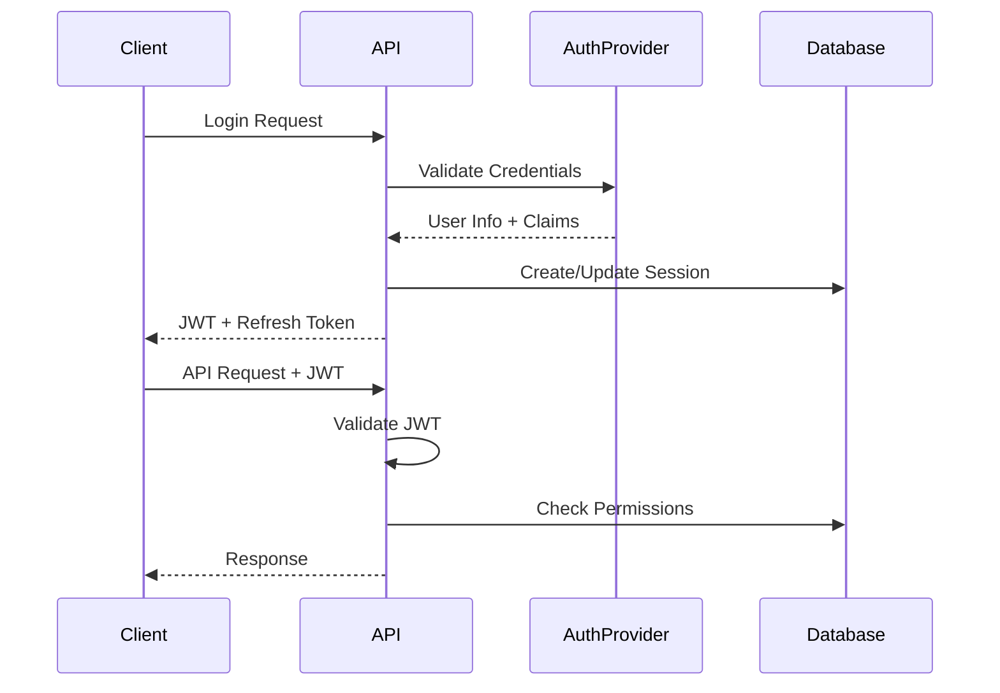

# FleetD API Architecture

## Overview

FleetD uses a modern API architecture based on Connect RPC (gRPC-Web compatible) with clear separation between internal and public APIs. This design enables both open-source self-hosted deployments and a managed cloud offering.

## Design Principles

Following the Supabase model:
- **Same Product**: OSS and cloud versions use identical code and APIs
- **Self-Contained OSS**: Open-source version is fully functional without cloud dependencies
- **Cloud Enhancements**: Managed offering adds scalability, infrastructure, and enterprise features
- **Pluggable Auth**: Authentication system supports multiple providers (built-in, OIDC, SAML, etc.)

## API Structure

### Directory Layout

```
proto/
├── internal/           # Internal APIs (device-to-server, inter-service)
│   ├── agent/v1/      # Agent communication (fleetd -> fleets)
│   ├── fleetd/v1/     # Core fleet management
│   └── health/v1/     # Health checks
└── public/v1/         # Public APIs (frontend, mobile, third-party)
    ├── fleet.proto    # Fleet management API
    ├── auth.proto     # Authentication & authorization
    └── organization.proto # Multi-tenancy & teams
```

### API Layers

1. **Public APIs** (`/public/v1/`)
   - Used by: Web UI, mobile apps, third-party integrations
   - Authentication: JWT tokens, API keys
   - Protocol: Connect RPC (works with gRPC, gRPC-Web, and HTTP/JSON)
   - Versioning: Strict semantic versioning with backward compatibility

2. **Internal APIs** (`/internal/`)
   - Used by: On-device agents, inter-service communication
   - Authentication: mTLS, service tokens
   - Protocol: gRPC with Connect fallback
   - Versioning: More flexible, coordinated updates

## Connect RPC Benefits

- **Protocol Flexibility**: Single API works with gRPC, gRPC-Web, and REST/JSON
- **Type Safety**: Full type safety from proto to TypeScript/Go
- **Streaming**: Bidirectional streaming for real-time updates
- **Browser Compatible**: Works directly in browsers without proxies
- **Small Bundle Size**: Efficient code generation for web clients

## Authentication Architecture

### OSS Version (Self-Hosted)

```yaml
auth_providers:
  - type: built_in
    config:
      # Basic username/password auth
      # Stored in local database
  - type: ldap
    config:
      # Optional LDAP integration
```

### Cloud Version (Managed)

```yaml
auth_providers:
  - type: supabase_auth  # Or Auth0, Clerk, etc.
  - type: sso
    providers:
      - google
      - github
      - okta
      - azure_ad
  - type: saml
  - type: oidc
```

### Auth Flow



## Multi-Tenancy Design

### Data Isolation

Each organization's data is isolated using:
1. **Row-Level Security**: All queries filtered by org_id
2. **Schema Separation**: Optional separate schemas per org (enterprise)
3. **Database Separation**: Optional dedicated databases (enterprise)

### Organization Hierarchy

```
Organization
├── Teams
│   ├── Members (with roles)
│   └── Device Groups (by tags)
├── Settings
│   ├── SSO Configuration
│   ├── Security Policies
│   └── Billing (cloud only)
└── Resources
    ├── Devices
    ├── Updates
    └── Configurations
```

## API Versioning Strategy

### Version Naming
- Format: `v1`, `v2`, `v3` (major versions only)
- Path: `/public/v1/`, `/internal/agent/v1/`

### Backward Compatibility
- **Minor Changes**: Add optional fields, new methods
- **Major Changes**: New version path (v1 -> v2)
- **Deprecation**: 6-month notice, 12-month support

### Proto Evolution Rules
1. Never change field numbers
2. Never change field types
3. Add new fields as optional
4. Use field deprecation annotations
5. New required fields = new major version

## Cloud vs OSS Feature Matrix

| Feature | OSS | Cloud | Implementation |
|---------|-----|-------|----------------|
| Core Fleet Management | ✅ | ✅ | Same codebase |
| Web UI | ✅ | ✅ | Same React app |
| Basic Auth | ✅ | ✅ | Built-in provider |
| SSO/SAML | ⚙️ | ✅ | Self-configure vs managed |
| Multi-tenancy | ⚙️ | ✅ | Single vs multi-org |
| Scalability | Manual | Auto | K8s vs managed infra |
| Monitoring | Self-setup | Built-in | Prometheus vs managed |
| Updates | Manual | Automatic | Git pull vs managed |
| Support | Community | Priority | GitHub vs dedicated |
| Custom Domain | ✅ | ✅ | Self-configure vs managed |
| API Rate Limits | Configurable | Automatic | nginx vs cloud CDN |
| Backup/Restore | Manual | Automatic | Scripts vs managed |
| Audit Logs | ✅ | ✅ Enhanced | File vs centralized |

## Deployment Architecture

### OSS Deployment

```yaml
# docker-compose.yml
services:
  fleets:
    image: fleetd/fleets:latest
    environment:
      - AUTH_PROVIDER=built_in
      - DATABASE_URL=postgresql://...
    ports:
      - "8080:8080"

  postgres:
    image: postgres:15
    volumes:
      - ./data:/var/lib/postgresql/data
```

### Cloud Deployment

```yaml
# Kubernetes manifests
apiVersion: apps/v1
kind: Deployment
metadata:
  name: fleets-api
spec:
  replicas: 3  # Auto-scaled
  template:
    spec:
      containers:
      - name: fleets
        image: fleetd/fleets-cloud:latest
        env:
        - name: AUTH_PROVIDER
          value: "supabase"
        - name: TELEMETRY_ENDPOINT
          value: "internal-telemetry:4317"
```

## Security Considerations

### API Security
- **Rate Limiting**: Per-IP and per-user limits
- **CORS**: Configurable allowed origins
- **CSP Headers**: Strict content security policy
- **Input Validation**: Proto-based validation + business rules
- **SQL Injection**: Prepared statements only
- **XSS Prevention**: React's built-in protections

### Data Security
- **Encryption at Rest**: Database encryption
- **Encryption in Transit**: TLS 1.3 minimum
- **Secrets Management**: Environment variables (OSS), Vault (Cloud)
- **Audit Logging**: All API calls logged with context

## Implementation Roadmap

### Phase 1: Foundation ✅
- [x] Proto structure separation
- [x] Connect RPC setup
- [x] Basic auth hooks
- [x] Web UI with Connect client

### Phase 2: Enhanced Auth (Current)
- [ ] JWT token management
- [ ] Refresh token rotation
- [ ] API key generation
- [ ] Role-based access control

### Phase 3: Cloud Features
- [ ] Multi-tenancy support
- [ ] SSO provider integration
- [ ] Usage tracking
- [ ] Billing integration hooks

### Phase 4: Enterprise
- [ ] SAML support
- [ ] Audit log streaming
- [ ] Custom auth providers
- [ ] White-labeling support

## Development Guidelines

### Adding New APIs

1. **Determine API Type**:
   - Public: User-facing features
   - Internal: System communication

2. **Design Proto First**:
   ```proto
   service NewService {
     rpc Method(Request) returns (Response);
   }
   ```

3. **Generate Code**:
   ```bash
   just proto
   ```

4. **Implement Service**:
   - Go: Implement service interface
   - TypeScript: Use generated client

5. **Add Auth Hooks**:
   - Check permissions in service methods
   - Add org_id filtering

### Testing Strategy

1. **Unit Tests**: Service logic
2. **Integration Tests**: Full API flow
3. **E2E Tests**: UI to database
4. **Load Tests**: Performance validation

## Monitoring & Observability

### Metrics (OpenTelemetry)
- Request rate, latency, errors
- Device connections
- Update success rate
- Auth provider latency

### Logging (Structured)
- Request/response logs
- Error traces
- Audit events
- Performance metrics

### Tracing (Distributed)
- Request flow visualization
- Cross-service correlation
- Performance bottlenecks
- Error propagation

## Conclusion

This architecture provides a solid foundation for both open-source and cloud offerings while maintaining a single codebase. The use of Connect RPC ensures modern, efficient APIs that work across all platforms, while the clear separation between internal and public APIs enables secure, scalable deployments.