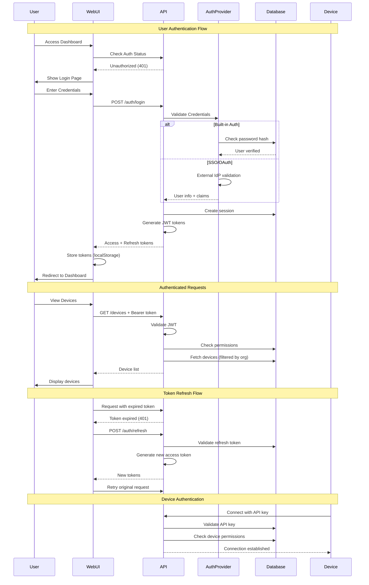
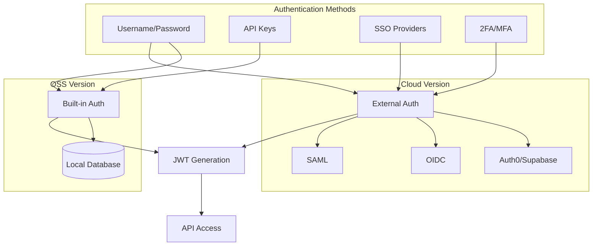
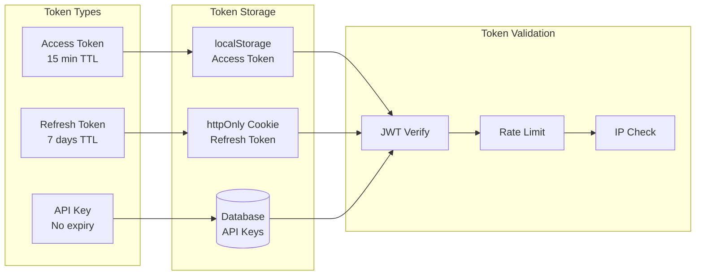
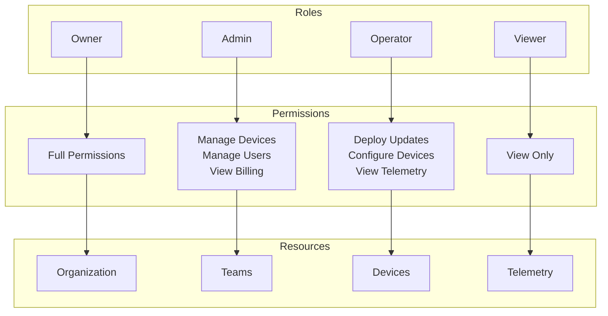
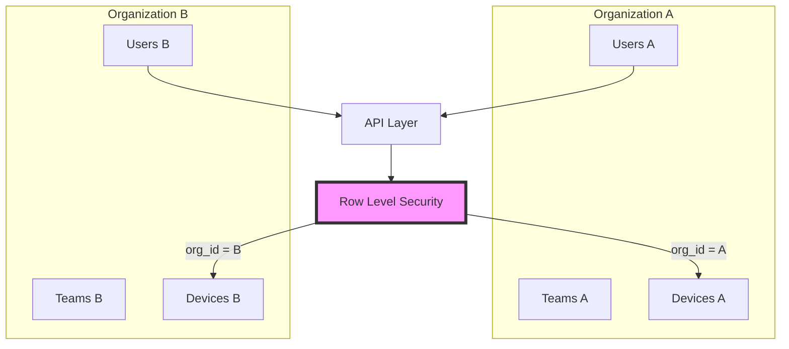
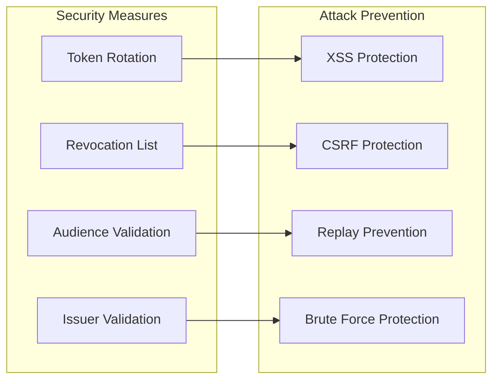
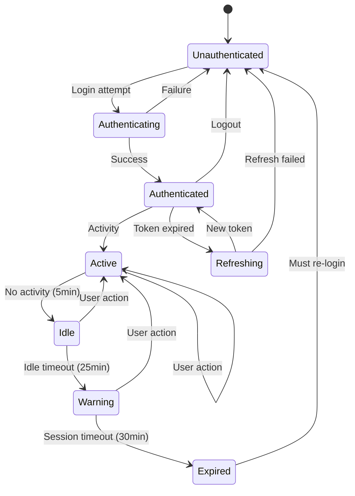
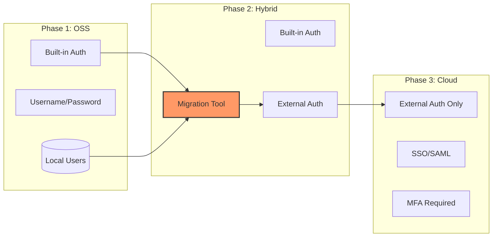
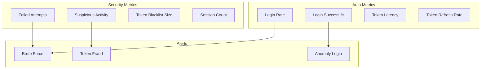

# FleetD Authentication Architecture

## Overview

FleetD implements a flexible, pluggable authentication system designed to support both open-source self-hosted deployments and managed cloud offerings. The architecture follows industry best practices with JWT tokens, refresh tokens, and support for multiple auth providers.

## Authentication Flow



## Authentication Layers

### 1. User Authentication



### 2. Token Architecture



## Authorization Model

### Role-Based Access Control (RBAC)



### Multi-Tenancy Isolation



## Implementation Details

### JWT Token Structure

```json
{
  "header": {
    "alg": "RS256",
    "typ": "JWT"
  },
  "payload": {
    "sub": "user_123",
    "email": "user@example.com",
    "org_id": "org_456",
    "role": "admin",
    "permissions": ["devices:read", "devices:write", "telemetry:read"],
    "iat": 1699000000,
    "exp": 1699003600,
    "iss": "fleetd.sh",
    "aud": "fleetd-api"
  },
  "signature": "..."
}
```

### API Key Format

```
fleetd_pk_live_a1b2c3d4e5f6g7h8i9j0k1l2m3n4o5p6
└─────┘ └┘ └──┘ └────────────────────────────┘
  prefix │  env            random token
        type
```

## Security Features

### 1. Token Security



### 2. Session Management



## Provider Configuration

### OSS Self-Hosted

```yaml
# config.yaml
auth:
  provider: built_in
  jwt:
    secret: ${JWT_SECRET}
    access_ttl: 15m
    refresh_ttl: 7d
  password:
    min_length: 12
    require_special: true
    bcrypt_cost: 12
  session:
    timeout: 30m
    max_concurrent: 5
```

### Cloud Managed

```yaml
# config.yaml
auth:
  provider: auth0  # or supabase, clerk, etc.
  auth0:
    domain: ${AUTH0_DOMAIN}
    client_id: ${AUTH0_CLIENT_ID}
    client_secret: ${AUTH0_CLIENT_SECRET}
    audience: ${AUTH0_AUDIENCE}
  sso:
    providers:
      - google
      - github
      - okta
      - azure_ad
  mfa:
    required: true
    methods:
      - totp
      - sms
      - webauthn
```

## API Endpoints

### Authentication Endpoints

| Endpoint | Method | Description | Auth Required |
|----------|--------|-------------|---------------|
| `/auth/login` | POST | User login | No |
| `/auth/logout` | POST | User logout | Yes |
| `/auth/refresh` | POST | Refresh tokens | Refresh token |
| `/auth/user` | GET | Current user info | Yes |
| `/auth/register` | POST | User registration (OSS) | No |
| `/auth/forgot-password` | POST | Password reset | No |
| `/auth/reset-password` | POST | Complete reset | Reset token |
| `/auth/verify-email` | POST | Email verification | Verify token |
| `/auth/sso/init` | POST | Start SSO flow | No |
| `/auth/sso/callback` | GET | SSO callback | No |

### API Key Management

| Endpoint | Method | Description | Auth Required |
|----------|--------|-------------|---------------|
| `/api-keys` | GET | List API keys | Yes |
| `/api-keys` | POST | Create API key | Yes |
| `/api-keys/:id` | DELETE | Revoke API key | Yes |
| `/api-keys/:id/rotate` | POST | Rotate API key | Yes |

## Migration Path (OSS → Cloud)



## Security Best Practices

### 1. Password Requirements (OSS)
- Minimum 12 characters
- Mix of uppercase, lowercase, numbers, special chars
- No common passwords (checked against list)
- No reuse of last 5 passwords
- Forced rotation every 90 days (configurable)

### 2. Token Management
- Short-lived access tokens (15 minutes)
- Refresh token rotation on use
- Revocation on suspicious activity
- IP binding for sensitive operations
- Device fingerprinting

### 3. Rate Limiting
```
/auth/login: 5 attempts per 15 minutes
/auth/refresh: 10 per minute
/api/*: 100 per minute (authenticated)
/api/*: 10 per minute (unauthenticated)
```

### 4. Audit Logging
All authentication events are logged:
- Login attempts (success/failure)
- Token generation/refresh
- Permission changes
- API key usage
- Failed authorization attempts

## Integration Examples

### React Hook Usage

```typescript
import { useAuth } from '@/hooks/use-auth'

function MyComponent() {
  const { user, login, logout, isLoading } = useAuth()

  if (isLoading) return <Loading />
  if (!user) return <LoginForm onLogin={login} />

  return (
    <Dashboard user={user} onLogout={logout} />
  )
}
```

### API Client Usage

```typescript
import { fleetClient } from '@/lib/api/client'
import { env } from '@/env'

// Client automatically includes auth token
const devices = await fleetClient.listDevices({})

// Manual token handling
const response = await fetch(`${env.NEXT_PUBLIC_API_URL}/custom`, {
  headers: {
    Authorization: `Bearer ${getAccessToken()}`,
  },
})
```

### Server-Side Auth Check

```typescript
// app/api/route.ts
import { verifyAuth } from '@/lib/auth'
import { env } from '@/env'

export async function GET(req: Request) {
  const user = await verifyAuth(req)
  if (!user) {
    return new Response('Unauthorized', { status: 401 })
  }

  // Check permissions
  if (!user.permissions.includes('devices:read')) {
    return new Response('Forbidden', { status: 403 })
  }

  // Process request...
}
```

## Monitoring & Observability

### Key Metrics



### Dashboard Panels
- Active sessions by user
- Login attempts (success/failure)
- Token refresh patterns
- API key usage
- Geographic login distribution
- Device fingerprint changes

## Troubleshooting

### Common Issues

1. **Token Expired**: Automatic refresh should handle this
2. **Invalid Signature**: Check JWT secret configuration
3. **CORS Errors**: Verify allowed origins
4. **Rate Limited**: Implement exponential backoff
5. **Session Conflicts**: Clear all tokens and re-login

### Debug Mode

Enable debug logging:
```typescript
// env.ts
DEBUG_AUTH: z.boolean().default(true)

// Logs all auth operations
if (env.DEBUG_AUTH) {
  console.log('[Auth]', operation, details)
}
```

## Future Enhancements

- [ ] WebAuthn/Passkeys support
- [ ] Hardware token support (YubiKey)
- [ ] Risk-based authentication
- [ ] Passwordless login
- [ ] Social login providers
- [ ] Enterprise SSO (SAML 2.0)
- [ ] OAuth2 authorization server
- [ ] Zero-trust architecture