# FleetD Complete Device & Software Lifecycle

## Overview

FleetD provides end-to-end management for edge computing infrastructure, covering the complete lifecycle:

```mermaid
graph LR
    A[🏭 Build] --> B[📦 Package]
    B --> C[🚀 Deploy]
    C --> D[⚙️ Configure]
    D --> E[📊 Monitor]
    E --> F[🔄 Update]
    F --> C
```



## 1. Device Provisioning & Configuration

### Capabilities
- **OS Image Creation**: Custom images with pre-installed software
- **Network Configuration**: WiFi, Ethernet, VPN setup
- **Initial Setup**: SSH keys, users, security hardening
- **Auto-Discovery**: mDNS/Zeroconf for headless setup
- **Bulk Provisioning**: Flash multiple devices simultaneously

### Implementation
```go
// Device provisioning with software pre-installed
provisioner := provision.New(config)
provisioner.AddArtifact("edge-app", "v2.1.0")
provisioner.ConfigureNetwork(wifiCredentials)
provisioner.Flash(devicePath)
```

## 2. Software Artifact Management

### Supported Artifact Types
- **Binaries**: Standalone executables (Go, Rust, C++)
- **Containers**: OCI/Docker images
- **Packages**: deb, rpm, apk, nixpacks
- **Scripts**: Shell, Python with dependencies
- **Archives**: tar.gz with manifests

### Storage & Distribution
```yaml
# Artifact storage backends
backends:
  - type: s3
    bucket: fleet-artifacts
    region: us-west-2
  - type: oci-registry
    url: registry.fleet.local
  - type: ipfs
    gateway: https://ipfs.fleet.local
```

### CI/CD Integration
```yaml
# GitHub Actions example
- name: Build and Deploy
  uses: fleetd/deploy@v1
  with:
    artifact: my-app-${{ matrix.arch }}
    version: ${{ github.sha }}
    strategy: canary
    target: production-${{ matrix.arch }}
```

## 3. Deployment Strategies

### Available Strategies

| Strategy | Use Case | Rollback Time | Risk Level |
|----------|----------|---------------|------------|
| **Canary** | Production updates | < 1 min | Low |
| **Rolling** | Large fleets | < 5 min | Medium |
| **Blue-Green** | Critical systems | Instant | Very Low |
| **All-at-Once** | Development/Testing | N/A | High |

### Canary Deployment Example
```typescript
const deployment = {
  strategy: 'canary',
  phases: [
    { percentage: 10, duration: '5m', validation: 'auto' },
    { percentage: 30, duration: '10m', validation: 'auto' },
    { percentage: 60, duration: '15m', validation: 'manual' },
    { percentage: 100, duration: '0', validation: 'auto' }
  ],
  rollback: {
    triggers: [
      { metric: 'error_rate', threshold: 0.05, action: 'immediate' },
      { metric: 'crash_loop', threshold: 3, action: 'immediate' },
      { metric: 'cpu_usage', threshold: 90, action: 'gradual' }
    ]
  }
}
```

## 4. Process Management

### Agent Capabilities
- **Process Lifecycle**: Start, stop, restart with policies
- **Resource Limits**: CPU, memory, disk I/O constraints
- **Health Checks**: HTTP, TCP, exec-based monitoring
- **Log Management**: Streaming, rotation, centralization
- **Metrics Collection**: CPU, memory, network, custom metrics

### Process Configuration
```yaml
runtime:
  type: systemd
  restart: on-failure
  limits:
    memory: 2Gi
    cpu: 1500m
  health_check:
    http:
      path: /health
      interval: 30s
      timeout: 5s
```

## 5. Monitoring & Observability

### System Metrics
```protobuf
// Comprehensive device & app metrics
message DeviceMetrics {
  // System metrics
  SystemInfo system_info = 1;
  LoadAverage load_average = 2;
  repeated NetworkInterface interfaces = 3;

  // Application metrics
  repeated ProcessStatus processes = 4;
  map<string, double> custom_metrics = 5;

  // Resource usage
  float cpu_percent = 6;
  uint64 memory_used = 7;
  uint64 disk_used = 8;
}
```

### Real-time Telemetry
- **Streaming**: WebSocket/SSE for live metrics
- **Aggregation**: Time-series data with retention policies
- **Alerting**: Threshold-based and anomaly detection
- **Dashboards**: Device overview, app performance, fleet health

## 6. Update Management

### OTA Updates
```go
// Automatic updates with validation
updateManager.ScheduleUpdate(UpdateConfig{
    Application: "edge-app",
    FromVersion: "2.0.0",
    ToVersion: "2.1.0",
    Strategy: CanaryStrategy{
        Initial: 10,
        Increment: 20,
        SuccessRate: 0.95,
    },
    Validation: func(metrics Metrics) bool {
        return metrics.ErrorRate < 0.01 &&
               metrics.CPUUsage < 80 &&
               metrics.Latency.P99 < 100
    },
})
```

### Rollback Mechanisms
1. **Automatic**: Based on health metrics
2. **Manual**: Operator-initiated
3. **Scheduled**: Time-based fallback
4. **Circuit Breaker**: Stop propagation on failure cluster

## 7. Security & Compliance

### Security Features
- **Signed Artifacts**: Ed25519/RSA signatures
- **Encrypted Transport**: TLS 1.3 for all communications
- **Vulnerability Scanning**: Pre-deployment checks
- **RBAC**: Role-based access control
- **Audit Logging**: Complete deployment history

### Compliance Tracking
```sql
-- Audit trail for compliance
SELECT
  deployment_id,
  artifact_version,
  signature_verified,
  vulnerability_scan_result,
  deployed_by,
  deployment_time,
  rollback_reason
FROM deployment_audit
WHERE compliance_framework = 'SOC2'
```

## 8. Multi-Platform Support

### Device Tiers
```
Tier 1: Full OS (Linux/Windows)
  ├── x86_64 servers
  ├── ARM64 SBCs (Raspberry Pi, Jetson)
  └── Industrial PCs

Tier 2: Embedded Linux
  ├── OpenWRT routers
  ├── Yocto devices
  └── BuildRoot systems

Tier 3: RTOS/Microcontrollers
  ├── ESP32/ESP8266
  ├── STM32
  └── Nordic nRF52

Tier 4: Sensors
  ├── LoRaWAN devices
  └── Zigbee sensors
```

## Complete Example: Edge ML Deployment

```bash
# 1. Build and upload ML model artifact
fleetd artifact upload \
  --name edge-ml-model \
  --version 3.2.0 \
  --file model.tar.gz \
  --platform linux/arm64

# 2. Create application definition
fleetd app create \
  --name inference-engine \
  --artifact edge-ml-model:3.2.0 \
  --runtime docker \
  --health-check http://localhost:8080/health

# 3. Deploy with canary strategy
fleetd deploy create \
  --app inference-engine \
  --target group:edge-stores \
  --strategy canary \
  --initial 5% \
  --increment 15% \
  --interval 10m \
  --rollback-on-error 5%

# 4. Monitor deployment
fleetd deploy watch dep-xyz123 \
  --metrics cpu,memory,inference_time \
  --alert-on error_rate>0.01

# 5. Promote or rollback
fleetd deploy promote dep-xyz123  # If successful
fleetd deploy rollback dep-xyz123  # If issues detected
```

## Benefits

### For DevOps Teams
- **GitOps Ready**: Declarative configurations
- **CI/CD Native**: Direct integration with pipelines
- **Observable**: Comprehensive metrics and logging
- **Testable**: Dry-run and staging environments

### For Operations
- **Resilient**: Automatic rollback and recovery
- **Scalable**: 10 to 10,000+ devices
- **Secure**: End-to-end encryption and signing
- **Auditable**: Complete deployment history

### For Business
- **Reduced Downtime**: Safe deployment strategies
- **Faster Updates**: Automated rollout process
- **Lower Risk**: Gradual deployments with validation
- **Cost Effective**: Efficient resource utilization

## Architecture Benefits

1. **Unified Platform**: Single system for devices and software
2. **Edge-Native**: Designed for unreliable networks
3. **Multi-Protocol**: gRPC, MQTT, CoAP support
4. **Extensible**: Plugin architecture for custom needs
5. **Cloud-Agnostic**: Works with any infrastructure

## Comparison with Alternatives

| Feature | FleetD | AWS IoT | Azure IoT | Balena |
|---------|--------|---------|-----------|---------|
| Self-Hosted | ✅ | ❌ | ❌ | Partial |
| Multi-Cloud | ✅ | ❌ | ❌ | ✅ |
| MCU Support | ✅ | ✅ | ✅ | ❌ |
| Canary Deploy | ✅ | Manual | Manual | ❌ |
| Process Monitor | ✅ | ❌ | ❌ | ✅ |
| Custom Images | ✅ | ❌ | ❌ | ✅ |
| GitOps | ✅ | Partial | Partial | ✅ |

## Next Steps

1. **Quick Start**: Deploy FleetD in 5 minutes
2. **Tutorials**: Step-by-step guides for common scenarios
3. **API Reference**: Complete API documentation
4. **SDKs**: Go, Python, JavaScript, Rust clients
5. **Community**: Discord, GitHub Discussions