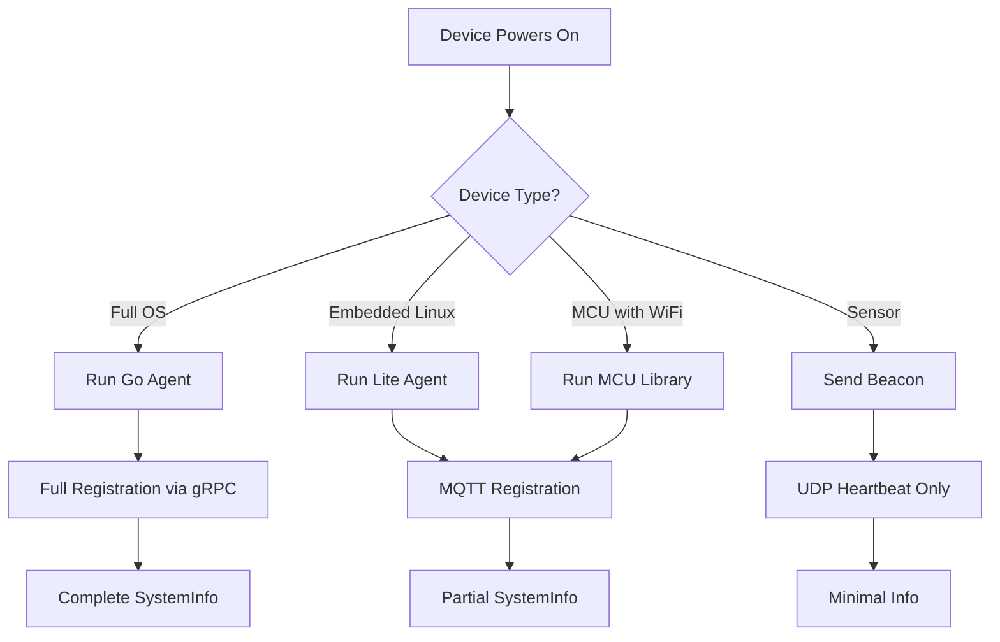

# IoT Device Support Architecture

## Device Tiers

FleetD supports multiple device tiers with different capabilities:

### Tier 1: Full OS Devices (Linux/Windows/macOS)
- **Examples**: Servers, PCs, Raspberry Pi, Jetson Nano
- **Agent**: Full Go agent with gopsutil
- **Protocol**: Full Connect RPC with all features
- **System Info**: Complete collection via OS APIs

### Tier 2: Embedded Linux
- **Examples**: OpenWRT routers, Yocto devices, BuildRoot systems
- **Agent**: Lightweight Go agent or C agent
- **Protocol**: Connect RPC or MQTT
- **System Info**: Subset based on available /proc and /sys

### Tier 3: RTOS/Microcontroller
- **Examples**: ESP32, STM32, nRF52, Arduino
- **Agent**: Minimal C/C++ library
- **Protocol**: MQTT or CoAP
- **System Info**: Device-specific minimal set

### Tier 4: Extremely Constrained
- **Examples**: ESP8266, ATtiny, sensors
- **Agent**: Ultra-minimal reporting
- **Protocol**: Simple UDP beacons
- **System Info**: ID + status only

## Adaptive System Information Collection

```protobuf
// Extended device proto to handle IoT diversity
message SystemInfo {
  // Always available (even on microcontrollers)
  string device_id = 1;        // Unique identifier (MAC, chip ID, etc.)
  string firmware_version = 2;  // Or agent version

  // Usually available
  string device_class = 3;      // "full_os", "embedded_linux", "rtos", "bare_metal"
  uint64 uptime_ms = 4;         // Milliseconds since boot

  // OS-specific (null on microcontrollers)
  optional OSInfo os_info = 5;
  optional NetworkInfo network_info = 6;
  optional HardwareInfo hardware_info = 7;

  // Microcontroller-specific
  optional MCUInfo mcu_info = 8;

  // Generic key-value for platform-specific data
  map<string, string> custom_metrics = 20;
}

message MCUInfo {
  string chip_model = 1;       // "ESP32-WROOM-32", "STM32F4", etc.
  string chip_id = 2;          // Unique chip identifier
  uint32 cpu_freq_mhz = 3;     // CPU frequency
  uint32 free_heap = 4;        // Available RAM in bytes
  uint32 min_free_heap = 5;    // Minimum free heap seen
  uint32 flash_size = 6;       // Flash storage in bytes
  float temperature_c = 7;     // Chip temperature if available
  uint32 reset_reason = 8;     // Why device last reset
  repeated string peripherals = 9; // "WiFi", "BLE", "LoRa", etc.
}
```

## Platform-Specific Collection Examples

### ESP32 (ESP-IDF)
```c
void collect_esp32_info(mcu_info_t* info) {
    // Chip identification
    esp_chip_info_t chip_info;
    esp_chip_info(&chip_info);

    uint8_t mac[6];
    esp_efuse_mac_get_default(mac);
    sprintf(info->chip_id, "%02X%02X%02X%02X%02X%02X",
            mac[0], mac[1], mac[2], mac[3], mac[4], mac[5]);

    // Memory info
    info->free_heap = esp_get_free_heap_size();
    info->min_free_heap = esp_get_minimum_free_heap_size();

    // Flash size
    info->flash_size = spi_flash_get_chip_size();

    // Temperature (if sensor available)
    #ifdef CONFIG_IDF_TARGET_ESP32S2
    temp_sensor_read_celsius(&info->temperature);
    #endif

    // Reset reason
    info->reset_reason = esp_reset_reason();

    // Network status (if WiFi connected)
    if (wifi_connected) {
        info->rssi = get_wifi_rssi();
        strcpy(info->ip_addr, get_ip_address());
    }
}
```

### STM32 (Bare Metal)
```c
void collect_stm32_info(device_info_t* info) {
    // Unique ID from factory-programmed area
    uint32_t* uid = (uint32_t*)UID_BASE;
    sprintf(info->device_id, "%08X%08X%08X", uid[0], uid[1], uid[2]);

    // Flash size from device registers
    info->flash_size = *((uint16_t*)FLASHSIZE_BASE) * 1024;

    // Simple runtime counter
    info->uptime_ms = HAL_GetTick();

    // Voltage monitoring
    info->vcc_voltage = read_vcc_voltage();

    // Minimal "system" info
    info->fw_version = FIRMWARE_VERSION;
    info->hw_revision = read_hw_revision_pins();
}
```

### Arduino (Minimal)
```cpp
struct MinimalInfo {
    char id[17];
    unsigned long uptime;
    int freeRam;
    float voltage;
};

void collectInfo(MinimalInfo* info) {
    // Use MAC address as ID
    WiFi.macAddress().toCharArray(info->id, 17);

    // Uptime
    info->uptime = millis();

    // Free RAM (AVR specific)
    #ifdef __AVR__
    extern int __heap_start, *__brkval;
    int v;
    info->freeRam = (int)&v - (__brkval == 0 ? (int)&__heap_start : (int)__brkval);
    #else
    info->freeRam = ESP.getFreeHeap();
    #endif

    // Battery/supply voltage if monitored
    info->voltage = analogRead(VBAT_PIN) * 0.00488;
}
```

## Graceful Degradation Strategy

```go
// Agent attempts to collect what's available
func CollectSystemInfo() (*SystemInfo, error) {
    info := &SystemInfo{
        DeviceClass: detectDeviceClass(),
        CustomMetrics: make(map[string]string),
    }

    // Try OS-level collection
    if runtime.GOOS != "none" {  // Full OS available
        collectOSInfo(info)
        collectNetworkInfo(info)
        collectHardwareInfo(info)
    }

    // Try embedded-specific collection
    if isEmbeddedLinux() {
        collectEmbeddedLinuxInfo(info)
    }

    // Fall back to minimal collection
    if info.DeviceId == "" {
        info.DeviceId = getMACAddress() // or chip ID
    }

    if info.FirmwareVersion == "" {
        info.FirmwareVersion = getBuildVersion()
    }

    return info, nil
}
```

## Communication Protocol Adaptation

### Full Devices: Connect RPC
```go
// Standard protobuf over HTTP/2
client.Register(ctx, &RegisterRequest{
    SystemInfo: fullSystemInfo,
})
```

### Constrained Devices: MQTT
```c
// Lightweight JSON over MQTT
char json[256];
sprintf(json, "{\"id\":\"%s\",\"heap\":%d,\"rssi\":%d}",
        chip_id, free_heap, wifi_rssi);
mqtt_publish("fleet/device/status", json);
```

### Ultra-Constrained: CoAP/UDP
```c
// Binary packed format
struct __packed status_packet {
    uint8_t  msg_type;  // 0x01 = status
    uint8_t  device_id[6];  // MAC address
    uint16_t battery_mv;
    int8_t   temperature;
    uint8_t  flags;
};
coap_send(&status_packet, sizeof(status_packet));
```

## Registration Flow for Different Device Types



## Database Schema Adaptation

```sql
-- Flexible schema for heterogeneous devices
CREATE TABLE device_system_info (
    device_id TEXT PRIMARY KEY,
    device_class TEXT NOT NULL, -- 'full_os', 'embedded', 'mcu', 'sensor'

    -- Common fields (always populated)
    firmware_version TEXT,
    last_seen TIMESTAMP,

    -- OS device fields (nullable for MCUs)
    hostname TEXT,
    os TEXT,
    cpu_model TEXT,
    memory_total BIGINT,

    -- MCU fields (nullable for OS devices)
    chip_model TEXT,
    chip_id TEXT,
    free_heap INTEGER,
    reset_reason INTEGER,

    -- Flexible JSON for device-specific data
    custom_data JSONB,

    CHECK (
        (device_class = 'full_os' AND hostname IS NOT NULL) OR
        (device_class IN ('mcu', 'sensor') AND chip_id IS NOT NULL) OR
        device_class = 'embedded'
    )
);
```

## SDK Examples for Different Platforms

### ESP32 Arduino
```cpp
#include <FleetDevice.h>

FleetDevice fleet("mqtt://fleet.local", DEVICE_KEY);

void setup() {
    fleet.begin();
    fleet.setDeviceInfo("irrigation-controller", "ESP32");
    fleet.reportMetric("soil_moisture", readSoilMoisture());
}

void loop() {
    fleet.loop();  // Handles MQTT keepalive

    if (millis() % 60000 == 0) {
        fleet.reportStatus(FleetStatus{
            .heap = ESP.getFreeHeap(),
            .wifi_rssi = WiFi.RSSI(),
            .uptime = millis()
        });
    }
}
```

### Zephyr RTOS
```c
#include <fleet/fleet.h>

static struct fleet_context *fleet_ctx;

void main(void) {
    struct fleet_config cfg = {
        .transport = FLEET_TRANSPORT_COAP,
        .server = "coap://fleet.local",
        .device_id = get_device_id(),
    };

    fleet_ctx = fleet_init(&cfg);

    while (1) {
        fleet_report_vitals(fleet_ctx, &(struct fleet_vitals){
            .battery_mv = read_battery(),
            .temperature = read_temp_sensor(),
            .free_ram = k_mem_free_get(),
        });

        k_sleep(K_SECONDS(60));
    }
}
```

## Benefits of This Approach

1. **Universal Device Support**: From servers to 8-bit MCUs
2. **Graceful Degradation**: Collect what's available
3. **Efficient Protocols**: Right protocol for each device class
4. **Unified Management**: Single dashboard for all devices
5. **Resource Aware**: Minimal overhead on constrained devices

## Implementation Priority

1. **Phase 1**: Current implementation (Full OS devices)
2. **Phase 2**: MQTT bridge for ESP32/ESP8266
3. **Phase 3**: CoAP support for ultra-low power
4. **Phase 4**: Native SDKs for popular platforms