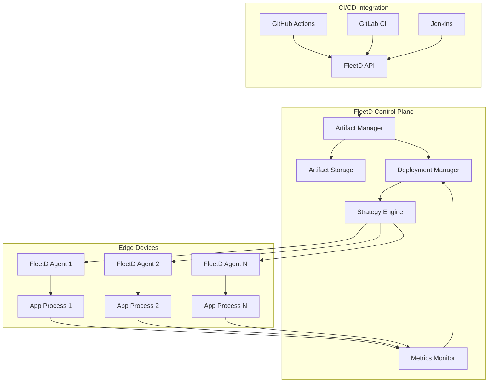

# FleetD Software Lifecycle Management

## Overview

FleetD provides complete software lifecycle management for edge applications, from build artifacts to production deployment with monitoring and rollback capabilities.

## Core Concepts

### 1. Artifacts
Software packages that can be deployed to devices:
- **Binaries**: Standalone executables
- **OCI Images**: Docker/Podman containers
- **Nixpacks**: Reproducible Nix packages
- **Archives**: tar.gz, zip with scripts
- **System Packages**: deb, rpm, apk

### 2. Applications
Logical groupings of artifacts with:
- Configuration
- Runtime requirements
- Health checks
- Resource limits
- Restart policies

### 3. Deployments
Controlled rollout of applications to device fleets:
- Target selection (device groups, tags, capabilities)
- Rollout strategy (canary, rolling, blue-green)
- Success criteria
- Rollback triggers

## Architecture



## Artifact Management

### Storage Backends
```go
type ArtifactStorage interface {
    // Store artifact with versioning
    Store(ctx context.Context, artifact *Artifact) (string, error)

    // Retrieve specific version
    Get(ctx context.Context, name, version string) (*Artifact, error)

    // List versions
    ListVersions(ctx context.Context, name string) ([]Version, error)

    // Generate signed download URL
    GetDownloadURL(ctx context.Context, artifact *Artifact) (string, error)
}

// Implementations
- S3/MinIO for cloud/self-hosted
- Local filesystem for development
- OCI registry for container images
- IPFS for distributed storage
```

### Artifact Metadata
```protobuf
message Artifact {
    string id = 1;
    string name = 2;
    string version = 3;
    ArtifactType type = 4;

    // Build metadata
    BuildInfo build_info = 5;

    // Runtime requirements
    Requirements requirements = 6;

    // Signatures for verification
    repeated Signature signatures = 7;

    // Size and checksums
    int64 size = 8;
    map<string, string> checksums = 9; // sha256, sha512, etc.

    // Storage location
    string storage_url = 10;

    // Platform compatibility
    repeated Platform platforms = 11;

    google.protobuf.Timestamp created_at = 12;
    map<string, string> labels = 13;
}

message Requirements {
    // Minimum resources
    int64 min_memory = 1;
    int64 min_storage = 2;
    int32 min_cpu_mhz = 3;

    // Required capabilities
    repeated string capabilities = 4; // "docker", "systemd", "gpu"

    // OS constraints
    string os_family = 5;    // "linux", "rtos"
    string min_kernel = 6;    // "5.10"
    repeated string arch = 7; // ["arm64", "amd64"]
}
```

## Application Definition

```yaml
# app.yaml - Application manifest
apiVersion: fleet.v1
kind: Application
metadata:
  name: edge-inference
  version: 2.1.0
spec:
  artifacts:
    - name: inference-engine
      version: 2.1.0
      type: binary
    - name: model-server
      version: 1.5.0
      type: oci-image

  configuration:
    env:
      MODEL_PATH: /data/models
      API_PORT: 8080
    files:
      - path: /etc/inference/config.yaml
        content: |
          model:
            type: yolov5
            threshold: 0.7

  runtime:
    type: systemd  # or docker, supervisor, raw
    restart: always
    startup_timeout: 30s

  healthcheck:
    http:
      path: /health
      port: 8080
      interval: 30s
      timeout: 5s
      retries: 3

  resources:
    limits:
      memory: 2Gi
      cpu: 2000m
    requests:
      memory: 1Gi
      cpu: 500m

  placement:
    device_selector:
      type: raspberry-pi
      min_memory: 4Gi
    node_affinity:
      - key: location
        operator: In
        values: ["edge", "store"]
```

## Deployment Strategies

### 1. Canary Deployment
```go
type CanaryStrategy struct {
    InitialPercentage int32
    IncrementPercentage int32
    IncrementInterval time.Duration

    SuccessCriteria SuccessCriteria
    RollbackTriggers []RollbackTrigger
}

func (c *CanaryStrategy) Execute(deployment *Deployment) error {
    // Start with small percentage
    targets := selectDevices(deployment.TargetDevices, c.InitialPercentage)

    for _, batch := range c.generateBatches() {
        // Deploy to batch
        if err := deployToBatch(batch); err != nil {
            return c.rollback(deployment, err)
        }

        // Monitor metrics
        if !c.checkSuccess(batch) {
            return c.rollback(deployment, ErrCanaryFailed)
        }

        // Wait before next batch
        time.Sleep(c.IncrementInterval)
    }

    return nil
}
```

### 2. Blue-Green Deployment
```go
type BlueGreenStrategy struct {
    TrafficSwitchDelay time.Duration
    ValidationPeriod time.Duration
    AutoRollback bool
}

func (bg *BlueGreenStrategy) Execute(deployment *Deployment) error {
    // Deploy to "green" environment
    green := deployment.CreateGreenEnvironment()
    if err := green.Deploy(); err != nil {
        return err
    }

    // Run validation
    if err := green.Validate(bg.ValidationPeriod); err != nil {
        green.Cleanup()
        return err
    }

    // Switch traffic
    if err := deployment.SwitchTraffic(green); err != nil {
        if bg.AutoRollback {
            deployment.SwitchTraffic(deployment.Blue)
        }
        return err
    }

    // Cleanup old version after success
    time.AfterFunc(bg.TrafficSwitchDelay, func() {
        deployment.Blue.Cleanup()
    })

    return nil
}
```

### 3. Rolling Update
```go
type RollingUpdateStrategy struct {
    MaxUnavailable int32
    MaxSurge int32
    UpdateBatchSize int32
    HealthCheckGracePeriod time.Duration
}
```

## Process Monitoring

### Agent Process Manager
```go
type ProcessManager struct {
    processes map[string]*ManagedProcess
    mu sync.RWMutex
}

type ManagedProcess struct {
    App         *Application
    Cmd         *exec.Cmd
    StartTime   time.Time
    RestartCount int32

    // Monitoring
    metrics     *ProcessMetrics
    logs        *LogCollector
    healthcheck *HealthChecker
}

func (p *ManagedProcess) Start() error {
    // Prepare environment
    p.Cmd.Env = p.App.GetEnvironment()

    // Set resource limits
    p.Cmd.SysProcAttr = &syscall.SysProcAttr{
        Setpgid: true,
        Rlimit: []syscall.Rlimit{
            {Resource: syscall.RLIMIT_AS, Cur: p.App.Resources.Memory},
            {Resource: syscall.RLIMIT_CPU, Cur: p.App.Resources.CPU},
        },
    }

    // Start process
    if err := p.Cmd.Start(); err != nil {
        return err
    }

    // Start monitoring
    go p.collectMetrics()
    go p.streamLogs()
    go p.checkHealth()

    return nil
}

func (p *ManagedProcess) collectMetrics() {
    ticker := time.NewTicker(10 * time.Second)
    defer ticker.Stop()

    for range ticker.C {
        stats := p.getProcessStats()
        p.metrics.Record(ProcessStats{
            PID:        p.Cmd.Process.Pid,
            CPUPercent: stats.CPUPercent(),
            Memory:     stats.MemoryInfo(),
            FDs:        stats.NumFDs(),
            Threads:    stats.NumThreads(),
            IOCounters: stats.IOCounters(),
        })
    }
}
```

## Rollback Mechanisms

### Automatic Rollback Triggers
```go
type RollbackTrigger struct {
    Type      TriggerType
    Threshold float64
    Duration  time.Duration
    Action    RollbackAction
}

var DefaultTriggers = []RollbackTrigger{
    {
        Type:      CrashLoopBackoff,
        Threshold: 3, // restarts
        Duration:  5 * time.Minute,
        Action:    ImmediateRollback,
    },
    {
        Type:      HighErrorRate,
        Threshold: 0.05, // 5% error rate
        Duration:  2 * time.Minute,
        Action:    GradualRollback,
    },
    {
        Type:      HealthCheckFailure,
        Threshold: 0.5, // 50% failing
        Duration:  1 * time.Minute,
        Action:    ImmediateRollback,
    },
}

func (d *Deployment) MonitorForRollback() {
    for _, trigger := range d.RollbackTriggers {
        go func(t RollbackTrigger) {
            if t.ShouldTrigger(d.GetMetrics()) {
                d.InitiateRollback(t.Action)
            }
        }(trigger)
    }
}
```

## CI/CD Integration

### GitHub Actions Workflow
```yaml
name: Deploy to Fleet
on:
  push:
    tags:
      - 'v*'

jobs:
  build-and-deploy:
    runs-on: ubuntu-latest
    steps:
      - uses: actions/checkout@v3

      - name: Build Application
        run: |
          cargo build --release --target aarch64-unknown-linux-gnu

      - name: Upload to FleetD
        uses: fleetd/upload-artifact@v1
        with:
          endpoint: ${{ secrets.FLEETD_ENDPOINT }}
          api_key: ${{ secrets.FLEETD_API_KEY }}
          name: my-app
          version: ${{ github.ref_name }}
          file: target/release/my-app
          platforms: linux/arm64

      - name: Create Deployment
        uses: fleetd/deploy@v1
        with:
          application: my-app
          version: ${{ github.ref_name }}
          strategy: canary
          target_group: production
          canary_percentage: 10
          increment: 20
          interval: 5m
```

### API Integration
```bash
# Upload artifact
curl -X POST https://fleet.example.com/api/v1/artifacts \
  -H "Authorization: Bearer $API_KEY" \
  -F "file=@myapp-v2.0.0-arm64" \
  -F "metadata={
    \"name\": \"myapp\",
    \"version\": \"2.0.0\",
    \"platform\": \"linux/arm64\",
    \"type\": \"binary\"
  }"

# Create deployment
curl -X POST https://fleet.example.com/api/v1/deployments \
  -H "Authorization: Bearer $API_KEY" \
  -d '{
    "application": "myapp",
    "version": "2.0.0",
    "strategy": {
      "type": "rolling",
      "max_unavailable": 1,
      "health_check_grace": "30s"
    },
    "target": {
      "group": "edge-stores",
      "selector": {
        "location": "us-west"
      }
    }
  }'
```

## Monitoring & Observability

### Application Metrics
```protobuf
message AppMetrics {
    string app_id = 1;
    string device_id = 2;

    // Process metrics
    float cpu_percent = 3;
    uint64 memory_bytes = 4;
    uint64 disk_io_read = 5;
    uint64 disk_io_write = 6;
    uint64 network_rx = 7;
    uint64 network_tx = 8;

    // Application metrics
    uint32 restart_count = 9;
    uint64 uptime_seconds = 10;
    map<string, double> custom_metrics = 11;

    // Health status
    HealthStatus health = 12;
    string health_message = 13;

    google.protobuf.Timestamp timestamp = 14;
}
```

### Log Streaming
```go
type LogStreamer struct {
    app    *Application
    buffer *ring.Ring
    subs   []chan LogEntry
}

func (l *LogStreamer) Stream(ctx context.Context) {
    scanner := bufio.NewScanner(l.app.Stdout)
    for scanner.Scan() {
        entry := LogEntry{
            Timestamp: time.Now(),
            Level:     l.parseLevel(scanner.Text()),
            Message:   scanner.Text(),
            AppID:     l.app.ID,
        }

        // Store in buffer
        l.buffer.Value = entry
        l.buffer = l.buffer.Next()

        // Send to subscribers
        for _, sub := range l.subs {
            select {
            case sub <- entry:
            default: // Don't block
            }
        }

        // Send to central logging if configured
        if l.app.Config.CentralLogging {
            l.sendToCentral(entry)
        }
    }
}
```

## Security

### Artifact Verification
```go
func (a *Artifact) Verify() error {
    // Check signatures
    for _, sig := range a.Signatures {
        if err := sig.Verify(a.Content); err != nil {
            return fmt.Errorf("signature verification failed: %w", err)
        }
    }

    // Verify checksums
    actual := sha256.Sum256(a.Content)
    expected := a.Checksums["sha256"]
    if hex.EncodeToString(actual[:]) != expected {
        return ErrChecksumMismatch
    }

    // Scan for vulnerabilities if configured
    if scanner := GetVulnerabilityScanner(); scanner != nil {
        if vulns := scanner.Scan(a); len(vulns) > 0 {
            return fmt.Errorf("vulnerabilities found: %v", vulns)
        }
    }

    return nil
}
```

## Benefits

1. **Complete Lifecycle Management**: From CI/CD to production monitoring
2. **Multi-Strategy Deployments**: Canary, blue-green, rolling updates
3. **Automatic Rollback**: Based on health metrics and error rates
4. **Platform Agnostic**: Supports binaries, containers, packages
5. **Secure by Default**: Signed artifacts, vulnerability scanning
6. **Observable**: Comprehensive metrics and log collection
7. **Resilient**: Handles network failures, partial deployments
8. **Scalable**: Works from 10 to 10,000+ devices